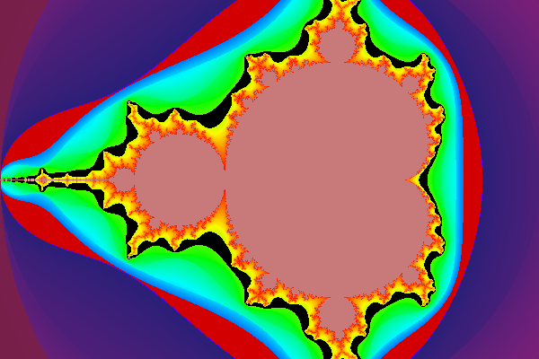
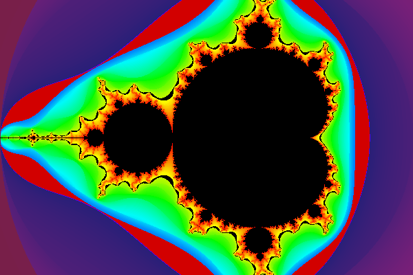
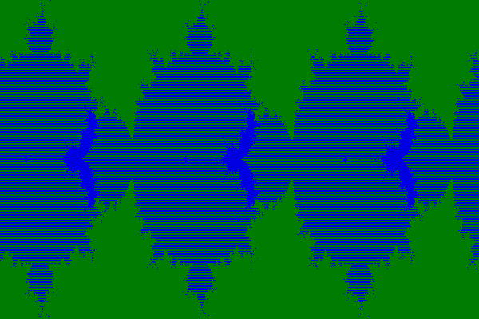
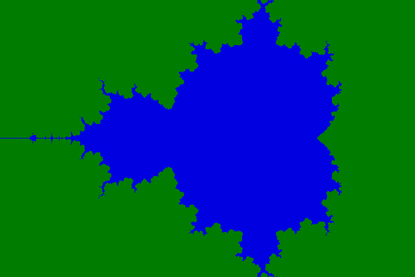
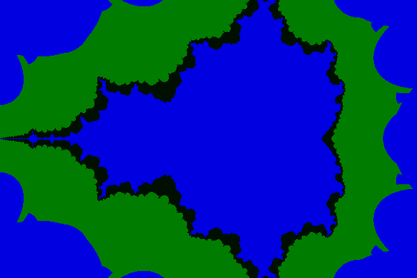
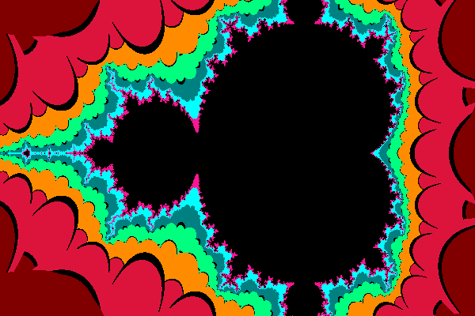

# python رنگ بندی اولیه در 
> تمام ایده هایی که برای رنگ بندی تصویر داشتم رو توی پایتون امتحان کردم تا رنگ نهایی عکس رو به دست بیارم

- عکس 3 

- عکس 18
# c تولید عکس اولیه در 
این مرحله سخت تر و جالب تر از مرحله قبل بود و باید رنگ هر کدوم از پیکسل ها رو خودمون مشخص میکردیم 

میزدیم c علاوه بر این باید کد مندلبرات رو با اعداد مختلط توی زبان 

- عکس 3

- عکس 6

- عکس 15

- عکس 26

زمان بیشتری بردc در کل چیدمان رنگ ها توی زبان
# c کد های چرخش و زوم و تغییر مرکز
یکی از جالب ترین قسمت های پروژه این بخش بود که باعث میشد یه کاری که توی نگاه اول خیلی سخت و غیرممکن به نظر میاد رو با یه تغییر خیلی ساده انجام بدیم

من این قسمت پروژه رو بیشتر از بقیه قسمت هاش دوست داشتم و در کل بیشترین تایم رو هم روی همین قسمت گذاشتم .دیباگ کردن کد ها و چک کردن عکس ها تایم زیادی برد

# sonic pi کد های موسیقی در 
بود sonic pi میشه گفت سخت ترین قسمت پروژه برای من کار با 

من موسیقی رو  گذاشته بودم برای آخر کار و تایم زیادی براش نگذاشته بودم
قبلا هم آشنایی زیادی با ساز های مختلف نداشتم پس مجبور شدم فقط با پیانو کار کنم چون فرصت زیادی نداشتم که با بقیه ساز ها آشنا بشم.ولی با اینکه سخت بود اما ازش خوشم اومد.   